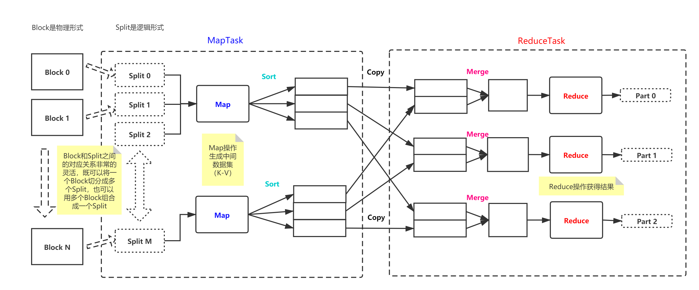

# MapReduce
MapReduce是Hadoop的核心组件中的分布式并行编程框架，顾名思义，MapReduce主要做以下两个工作：
1. Map：负责数据的映射，将数据做成键值对；
2. Reduce：根据映射的结果对数据进行整合。

## MapTask
### Split(切片)
Map操作首先是将整个文件在**逻辑形式**进行切分(block是物理上的切分)，得到一个个的Split，为什么要切分呢？因为我们要多个Mapper并行分布式处理来提升计算的效率，每一个Split都会由一个且仅由一个Mapper来处理(一对一的关系)，比如一个文件被切分成了N个Split，那么就会有N个Mapper来并行处理这些Split。  
Split的默认大小与Block相同，但也不会被此局限，你可以根据实际需求在系统所规定的范围内调节Split的大小，也就是说可以一个Block对应多个Split，或者多个Block对应一个Split，值得注意的是，这里所有的Block和所有的Split都同属于一个文件。
### Mapper
MapTask将读取Split中的**一条条记录**，**每一条记录都会调用一次**Mapper方法(Reducer方法是**一组数据调用一次**)，记录就被转化成<K,V,P>三元组，其中P记录的是该三元组的分块号，分块号P相同的<K,V>被分配到相同的Partition之中，且在Partition内部进行**排序**(内部也按照Key进行分类)，Mapper按照其分块号P，将这些键值对<K,V>发送到了相应的Reducer(每一个Partition都有一个与之对应的Reducer)。  
**为什么需要排序？**  
我们知道Reducer对数据的操作是按组进行的(Key值相同的键值对为一组)
- 如果Map完以后不对键值对进行排序，那么，Reducer收到的就是乱序的键值对的文件，就意味着，Reducer每次都需要遍历整个文件才能从中取出一组数据，分组越多，Reducer遍历整个文件的次数就越多，花费的时间也就越长，效率低下；
- 如果我们在Map的时候就对键值对进行排序，Reducer收到的就是一个按照分组排好序的文件，Reducer就可以按照分组依次处理，可以节省下大量的时间，且MapTask中Mapper的排序是并行进行的，也是高效的。
## ReduceTask
### Partition
一个Reducer是可以处理一组或者多组数据(Key相同的称为一组数据)，但是一组数据只能被一个Reducer处理，所以Reducer与分组数据之间的关系是一对多(1->N)，这就决定了一个Partition中是可以存放一组或者多组数据(有多个Key值)，但一组数据也只能有一个的分区号；
### Reducer
ReduceTask收到了来自不同Mapper但处于同一Partition的分块，将它们进行归并整合(Merge)成一个完整的Partition，随后Reducer对Partition中的分组按照顺序进行处理，每一组调用一次Reducer方法，得到该分组的结果并输出。